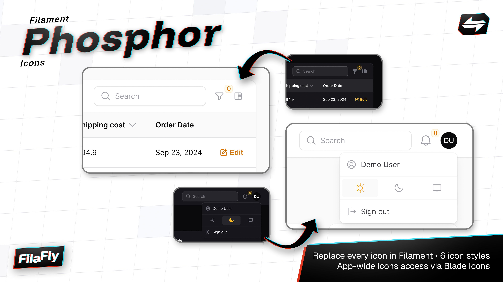

<p class="filament-hidden" align="center">
    
</p>

# Filament Phosphor Icons

A Phosphor icon set implementation for Filament 3.x, providing a comprehensive set of Phosphor icons that seamlessly integrate with Filament's interface.

## Installation

You can install the package via composer:

```bash
composer require filafly/filament-phosphor-icons
```

After the package is installed, you must register the plugin in your Filament Panel provider:

```php
use Filafly\Icons\PhosphorIcons;

public function panel(Panel $panel): Panel
{
    return $panel
        ->plugins([
            PhosphorIcons::make(),
        ]);
}
```

## Icon Styles

Phosphor icons come in multiple styles that you can switch between. Available styles include:

- Regular (default)
- Thin
- Light
- Bold
- Fill
- Duotone

You can change the style using the following methods:

```php
// Set to thin style
PhosphorIcons::make()->thin();

// Set to light style
PhosphorIcons::make()->light();

// Set to regular style (default)
PhosphorIcons::make()->regular();

// Set to bold style
PhosphorIcons::make()->bold();

// Set to fill style
PhosphorIcons::make()->fill();

// Set to duotone style
PhosphorIcons::make()->duotone();
```

## Override Specific Icons
If you need to override certain icons to use a different style, you can use either icon aliases or direct icon names.

### Using Icon Aliases
Use the `overrideStyleForAlias` method with a [Filament Icon Alias](https://filamentphp.com/docs/3.x/support/icons#available-icon-aliases). This method works with either a single icon key (string) or multiple icon keys (array).

```php
// Override a single icon key
PhosphorIcons::make()->overrideStyleForAlias('tables::actions.filter', 'thin');

// Override multiple icon keys at once
PhosphorIcons::make()->overrideStyleForAlias([
    'tables::actions.filter',
    'actions::delete-action',
], 'thin');
```

### Using Icon Names
Use the `overrideStyleForIcon` method with the actual Phosphor icon name. Like the alias method, this works with either a single icon name or multiple names.

```php
// Override a single icon
PhosphorIcons::make()->overrideStyleForIcon('phosphor-user', 'thin');

// Override multiple icons at once
PhosphorIcons::make()->overrideStyleForIcon([
    'phosphor-user',
    'phosphor-caret-up',
], 'thin');
```

## License
The MIT License (MIT). Please see [License](LICENSE.md) for more information.